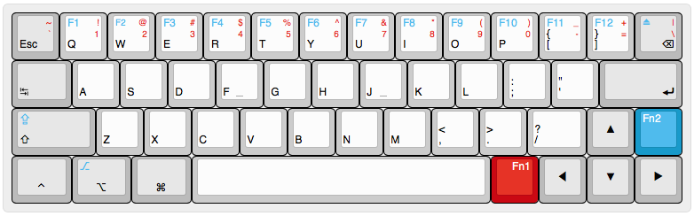
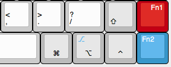
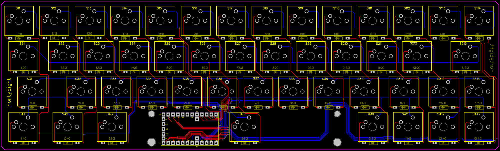
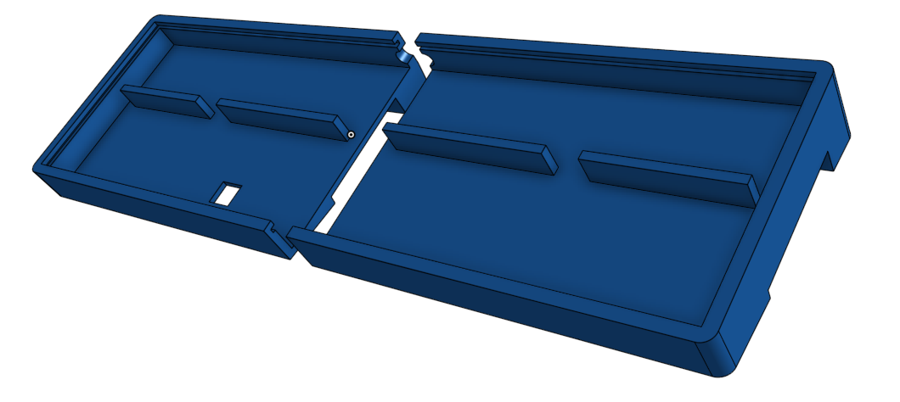
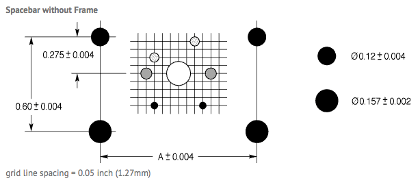
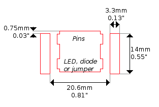
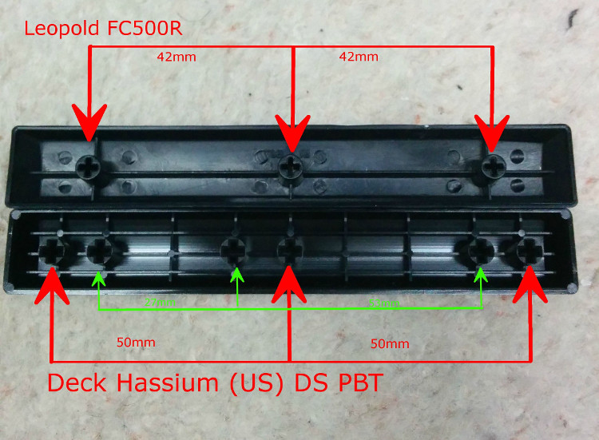

# The FortyEight

### Layout

Source: [layout.kbd.json](layout/default.kbd.json)

Online: http://www.keyboard-layout-editor.com/#/gists/c508c16d021675e48b9c4a68a4d9b2f8

**Default layout:**

**Alternative right-hand-side layout:**

### PCB

Source: [Gerber Drill](Gerber_Drill)

Online: https://easyeda.com/qiushihe/FortyEight-06QK2We7p

For the diodes use 1N4148.

### Firmware

Firmware source: [firmware.ino](firmware/firmware.ino)

Onboard controller is a [Teensy 2.0](https://www.pjrc.com/store/teensy.html).

Firmware is programmed with [Arduino IDE](https://www.arduino.cc/en/Main/Software),
[Teensyduino](https://www.pjrc.com/teensy/teensyduino.html) and
[Teensy Loader](https://www.pjrc.com/teensy/loader.html).

### Case

STL: [FortyEight Case V2](case/FortyEight-Case-V2.stl)

Online: https://cad.onshape.com/documents/feea34d0a9c6b57c6ef59bb9/w/05d58c69e3a7dbc46aef47f1/e/c60b2f45b17ec6026b843ee2

### Switches and Keycaps

**Switches**

Any cherry (or compatible) will do.

Switch dimension: 15.6mm / 15.6mm

**Keycaps:**

Supplier: http://pimpmykeyboard.com/blank-key-packs/dsa

* 1.00u x 40
* 1.25u x 5
* 1.75u x 2
* 6.25u x 1

... where 1u == 19.05mm.

It's best to use DSA or SA keycaps because DCS doesn't have certain length for the specific
row some keys need to be on. For DCS the alternative solution is to get everything from R1.

### Spacebar and Stabilizer

Only need one: 6.25u for the spacebar

**Cherry stabilizer specification:**

Supplier: https://www.originativeco.com/products/cherry-pcb-mounted-stabilizer

**Costar stabilizer specification:**

**Keycap specification:**

### Bill of Materials

* Switches: ~$50
* PCB: ~$45
* Teensy: ~$35
* Keycaps: ~$100
* Diodes: ~$10
* Stabilizer: ~$20
* Case: ~$160
* **Total: ~$420**
